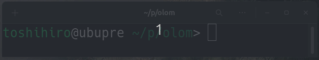

# OLOM (One-Line Oti-Mono)

A single-player falling block puzzle game. Control the falling pieces, place them on the field, and align the same numbers to clear lines.

- Randomly generated pieces (4 numbers) fall onto a 12-column field.  
- When a piece lands, its numbers are added to the field.  
- Align 4 or more of the same number horizontally to clear them. Aligning 5 or more yields higher scores.  
- The game ends when the field fills up (when a number exceeds 10).  

**Controls**:

- **[←]**, **[→]** or **[A]**, **[D]**: Move the piece left or right  
- **[↓]** or **[S]**: Drop the piece immediately  
- **[ESC]** or **[Q]**: Exit the game  

**Gameplay:**



## Installation & Execution

Since this game uses the `curses` library, Windows users will need to install `windows-curses` first:

```sh
pip install windows-curses
```

To run the game:

```sh
python olom.py
```
